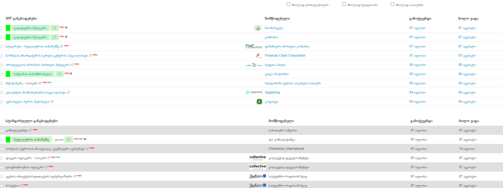

</img>


### გადმოწერა

გახსენით ტერმინალი და გაუშვით
```bash
git clone git@github.com:ddatunashvili/Jobs_ge_better.git
```

### დაყენების ინსტრუქცია
----
* გახსენით ქრომი
* გადადით more tools > extensions <br>
ან  გადადით ლინკზე (extensions)[chrome://extensions/]

* ჩართეთ developer mode<br>
* ჩააგდეთ ფოლდერი  და enjoy